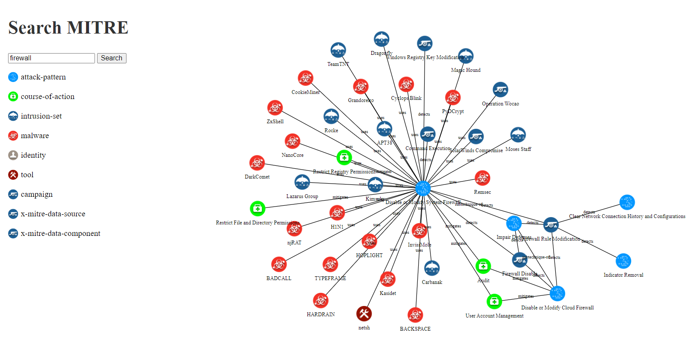
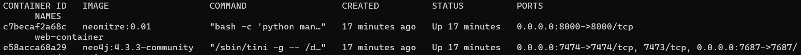

# MITRE ATT&CK Visualization

MITRE ATT&CK Visualization is a Django-based web application designed for managing and visualizing relationships between cybersecurity entities, utilizing the MITRE ATT&CK framework. The project integrates with Neo4j for graph database storage, connects to Taxii servers for threat intelligence data, and employs D3.js for interactive data visualization.


## Table of Contents

- [MITRE ATT\&CK Visualization](#mitre-attck-visualization)
  - [Table of Contents](#table-of-contents)
  - [Overview](#overview)
  - [Installation and Setup](#installation-and-setup)

## Overview

- **Graph Database**: Utilizes Neo4j for storing and querying relationships between various cybersecurity entities such as attack patterns, malware, tools, and more.

- **Taxii Integration**: Connects to Taxii servers to fetch and update threat intelligence data, providing up-to-date information on cyber threats.

- **D3.js Visualization**: Implements a dynamic and interactive visualization of the relationships between entities using D3.js, allowing users to explore and understand the cybersecurity landscape.

- **Django-based Web Application**: Built on the Django framework, providing a maintainable web application for managing cybersecurity data.

## Installation and Setup

1. Clone the repository:

   ```bash
   git clone https://github.com/happyCodingGirl-XD/NeoMitre
   ```
2. Build the containers:
   
    ```bash
    docker-compose -f docker-compose.yml up -d --build 
    ```
3. Load MITRE data:
   
    ```bash
    docker ps
    ```
    
    go to the web container
    
    ```bash
    docker exec -it c7becaf2a68c /bin/bash
    ```

    ```markdown
    python manage.py shell
    
    from neograph.models import MitreServer
    server,created = MitreServer.objects.get_or_create(url='https://cti-taxii.mitre.org/taxii/')
    server.update_data()
    ```

4. The sample .env file
   ```markdown
    NEO_USER=neo4j
    NEO_PWD=neo4j
    NEO_SERVER=neo-db
    NEO_PORT=7687
    NEO4J_AUTH=neo4j/neo4j
    NEO4J_ACCEPT_LICENSE_AGREEMENT=yes
    NEO4J_dbms_memory_pagecache_size=512M
    DJANGO_SUPERUSER_USERNAME=the_admin
    DJANGO_SUPERUSER_EMAIL=the_admin@admin.com
    DJANGO_SUPERUSER_PASSWORD=admin_pass   
  ```

